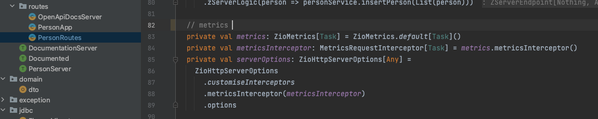

# Project description

# How to run locally

## Docker image

https://hub.docker.com/_/postgres
docker run --name some-postgres -e POSTGRES_PASSWORD=postgres -d postgres

POSTGRES_PASSWORD=postgres
create database duty;

# Metrics
## ZIO metrics

## Custom prometheus metrics

### Run couple times to create metrics
http://localhost:8080/api/v1/persons

### Fetch prometheus metrics by
http://localhost:8080/metrics

## DONE
* Swagger support (Open API support, describe endpoints in Tapir)
* Log metrics, prometheus metrics, visualize metrics [Grafana](https://zio.github.io/zio-zmx/docs/metrics/metrics_prometheus)
* Handle multiple exceptions in tapir with `oneOf` 

## TODO
* Profile support (Dev, Cloud)
* Tests (given when then / alternatives) 
* Retry policy, external service
* File export with resource-safe work, in a separate fiber

## Useful links
* [Github repo with several examples of quickstarts for ZIO](https://github.com/zio/zio-quickstarts)