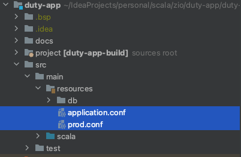
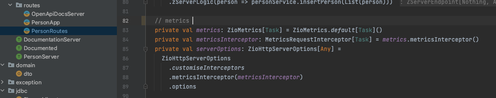

# Project description

Simple REST pet project using ZIO, based on Functional Effects

Scala version: `2.13.10`  
ZIO version: `2.0.6`

# How to run locally

## Using Docker 
Create container with Postgres DB and Main app.  
App URLs exposed to http://localhost:8080.

`docker-compose up` 

## SBT 
`sbt run`

**Warning** — don't forget to provide Postgresql DB  
All you need — define _properties_:
>   JDBC_DATABASE_URL: ...  
>   JDBC_DATABASE_USERNAME: ...   
>   JDBC_DATABASE_PASSWORD: ...  

`sbt run -DJDBC_DATABASE_URL="jdbc:postgresql://0.0.0.0:5432/postgres" -DJDBC_DATABASE_PASSWORD="postgres" -DJDBC_DATABASE_USERNAME="postgres"`

Make sure that sbt is already installed on your device. You can download it from [scala-sbt.org](https://www.scala-sbt.org/1.x/docs/Setup.html)

# Application configuration
The Application uses [Scala config](https://github.com/lightbend/config) to set properties.  
You can organise the profile management by defining different _configs_ for the different profiles in the `resource` folder.  
To run the application with a different conf file, use the command   
`sbt run -Dconfig.resource=prod.conf`.

# Metrics
## ZIO metrics

## Custom Prometheus metrics
You can check implementation in the `prometheus-metrics` branch

## How to check

### Run couple times to create metrics
http://localhost:8080/api/v1/persons

### Fetch prometheus metrics by
http://localhost:8080/metrics

# Documentation
### Swagger support (Open API, Tapir)  
http://localhost:8080/docs

## Useful links
* [GitHub repo with several examples of quickstarts for ZIO](https://github.com/zio/zio-quickstarts)